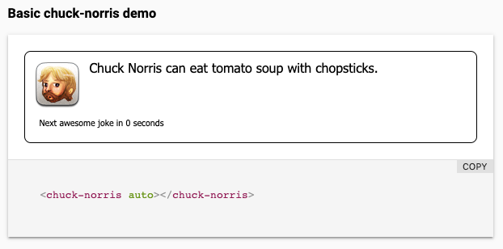

# chuck-norris

A Chuck Norris random jokes polymer 3.0 component

After a merge to master we should get test run on travis and also on saucelabs since the env variable TRAVIS_PULL_REQUEST will be set to true.

The result of this magnificent work is the a web-component that every n (default 5) seconds, updates itself with another magic joke about Chuck Norris. It will look like the below image.

